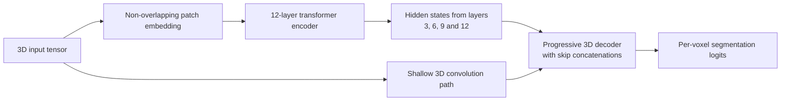

# Reference

<!-- repository-guide:start -->
## Repository guide

This repository contains an unofficial, architecture-only PyTorch implementation of UNETR for volumetric medical-image segmentation. It is a fork of `tamasino52/UNETR` and should be read as a compact model-definition reference rather than a complete training project.

### Architecture represented in `unetr.py`

### Dependency evidence

| Source | Evidence |
|---|---|
| `requirements.txt` | `torch==1.4.0` |
| `unetr.py` | Imports `torch`, `torch.nn`, and `torch.nn.functional`; all remaining imports are Python standard-library modules. |

No additional installable package is evidenced by the current source tree.

### Default model configuration

The `UNETR` constructor defaults to:

| Parameter | Default |
|---|---:|
| Image shape | `128 x 128 x 128` |
| Input channels | `4` |
| Output channels | `3` |
| Embedding dimension | `768` |
| Patch size | `16` |
| Attention heads | `12` |
| Transformer layers | `12` |
| Extracted layers | `3, 6, 9, 12` |

### Repository map

| Path | Purpose |
|---|---|
| `unetr.py` | Transformer, attention, MLP, 3D convolution blocks, decoder, and `UNETR` model definition |
| `requirements.txt` | Historical PyTorch pin |
| `Arche.JPG` | Architecture illustration referenced by the README |

### Reproducibility boundary

- The repository does not include a dataset loader, preprocessing pipeline, loss function, optimizer, training loop, inference command, checkpoint, benchmark, or automated test.
- The pinned PyTorch version is historical. Compatibility with a newer environment should be tested rather than assumed.
- The code defines the network architecture but does not, by itself, reproduce the paper's experiments or reported results.
- Input data conventions, normalization, label mapping, and evaluation protocol must be supplied by a downstream project.
<!-- repository-guide:end -->

Unofficial codebase for :
> [**UNETR: Transformers for 3D Medical Image Segmentation**],            
> Ali Hatamizadeh, Dong Yang, Holger Roth, Daguang Xu. 2021.
> *(https://arxiv.org/abs/2103.10504?context=cs.CV)*

 